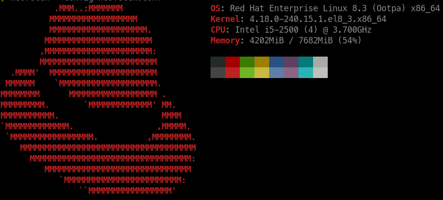
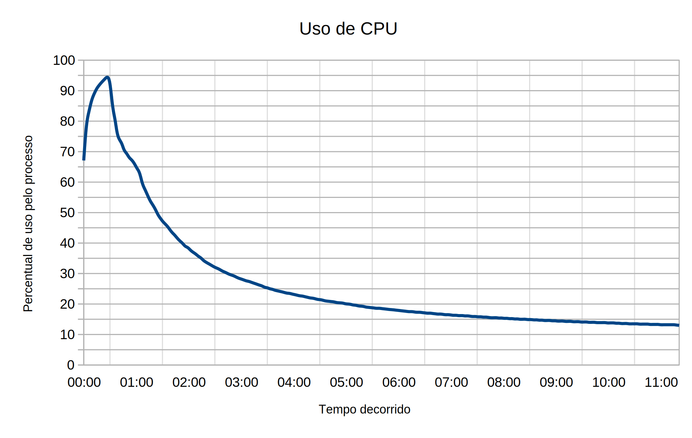
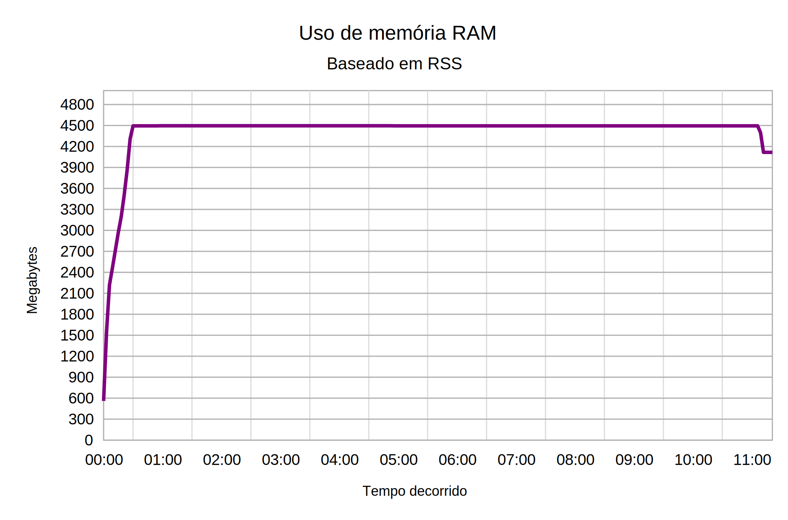
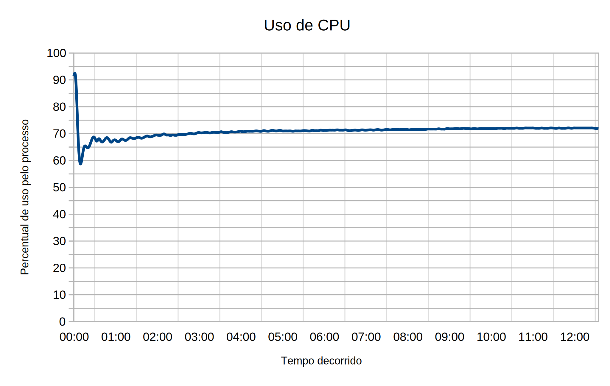
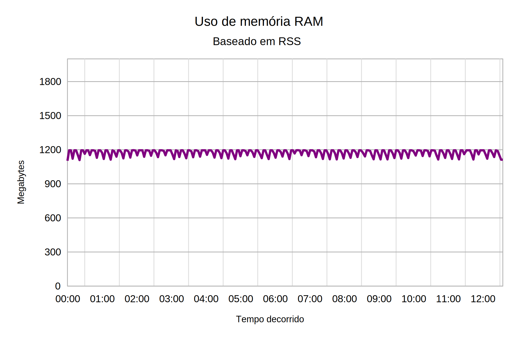
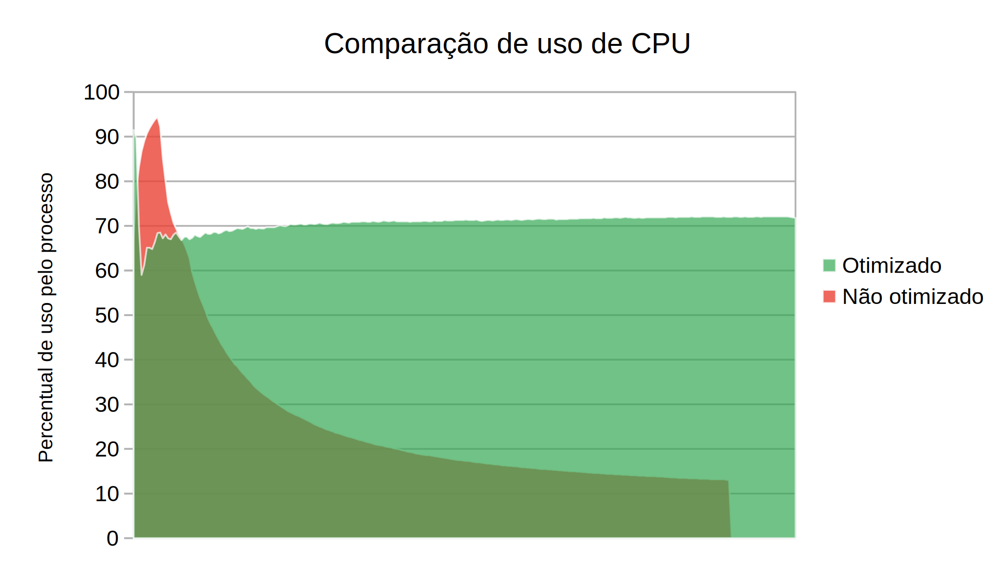
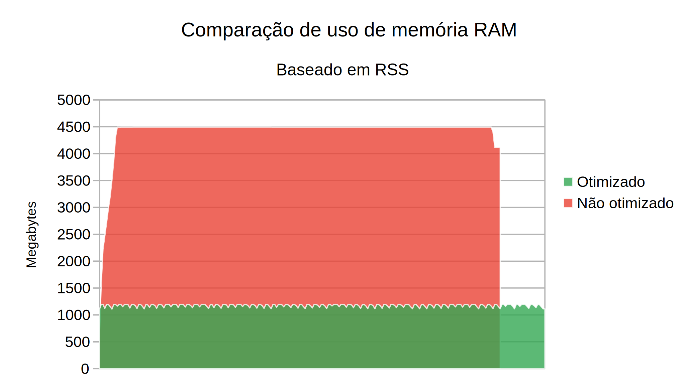

<div>Icons made by <a href="https://www.freepik.com" title="Freepik">Freepik</a> from <a href="https://www.flaticon.com/" title="Flaticon">www.flaticon.com</a></div>

## Sumário
1. Introdução
2. Requisitos
3. Utilização
4. Resultados
5. Ferramentas utilizadas no projeto
6. Considerações finais

## 1. Introdução
Repositório dedicado ao trabalho desenvolvido no período 2020/2 na matéria Projeto Interdisciplinar II do curso de Tecnologia e Análise em Desenvolvimento de Software (TADS) do IFG Câmpus Jataí. Matéria que neste período foi lecionada pelo Docente [Gustavo de Assis Costa](http://buscatextual.cnpq.br/buscatextual/visualizacv.do?id=K4759259U2).

De forma resumida, a proposta do projeto é composta pela inserção do CSV (comma-separated-values) disponibilizado no site [Coronavírus Brasil](https://covid.saude.gov.br) em um banco de dados, seja ele SQL ou NoSQL, por meio de um script utilizando a linguagem Python. Para consultar o enunciado completo do projeto [clique aqui](https://github.com/marcelsby/projeto-interdisciplinar-2/blob/master/assets/enunciado-projeto.pdf).


## 2. Requisitos
- Python >= 3.8
- Pip >= 19.3.1
- Última versão de algumas bibliotecas Python
- MySQL >= 8.0.21

### Instalação das bibliotecas necessárias
O gerenciador de pacotes `pip` permite a instalação de várias bibliotecas de uma vez a partir de um [arquivo de texto comum](https://pip.pypa.io/en/stable/reference/pip_install/#requirements-file-format). Então:

1. Clone o repositório:
```
git clone https://github.com/marcelsby/projeto-interdisciplinar-2
```
2. Navegue até o diretório onde se encontra o arquivo `requirements.txt`:
```
cd projeto-interdisciplinar-2/src/final/
```
3. Execute o `pip` utilizando o nosso `requirements.txt`:
```
pip install -r requirements.txt
```

Talvez o seu comando `pip` não funcione, então você pode tentar utilizar o `pip3.8`. Se não funcionar você terá que pesquisar sobre sua instalação do Python.

## 3. Utilização
- **Script de importação**

1. Para executar o script de importação baixe o CSV que se localiza [aqui](https://covid.saude.gov.br/).

2. Quando o download terminar coloque o arquivo no diretório `./src/final/data` e renomeie o arquivo para "full_database.py".

2. Após estes passos, navegue até `./src/final/` e utilize o executável do Python passando como argumento o script otimizado ou o não otimizado, que se localizam na pasta.

- **Script de monitoramento**

O script de monitoramento salva de 3 em 3 segundos os dados de horário atual, uso da CPU pelo processo e uso de memória RAM em megabytes, e coloca os resultados em um arquivo de saída. Sua utilização é intuitiva, para executá-lo navegue até `./src/final/benchmarks/` e execute o arquivo `logger.sh`.

Exemplo:

```
$ cd projeto-interdisciplinar-2/src/final/benchmarks/
$ ./logger.sh
```

## 4. Resultados
### **Hardware utilizado para os testes**



### Introdução
A primeira versão feita englobou principalmente a utilização da biblioteca Pandas apenas com a utilização dos parâmetros mais simples disponibilizados. Devido a alta quantidade de registros que precisaríamos inserir no banco de dados (quase 2 milhões de linhas) surgiu uma problemática: o consumo excessivo de memória RAM e a ociosidade do processador. 

Com base nisso eu analisei o que estava acontecendo e então cheguei a conclusão de que alocar quase 2 milhões de linhas com 18 colunas cada de uma vez não era algo muito interessante para o nosso volume de dados, se o nosso CSV fosse menor até que poderíamos utilizar o código atual sem problemas.

Além dessa alocação massiva e constante de RAM, era possível observar o uso decrescente do processador, pois maior parte do tempo estávamos alocando e não inserindo dados na nossa tabela. Um ponto que na minha opinião é muito desinteressante, penso eu que se temos um servidor com um ótimo processador nós queremos utilizá-lo da melhor maneira possível ao invés de deixá-lo ocioso, onerando a memória RAM.

Outro problema era a tabela gerada automaticamente pelo método `.toSql` do Pandas, que utilizava tipos de dados muito discrepantes dos dados do CSV. Por exemplo, a sigla do estado ao invés de utilizar `varchar(2)` estava utilizando `text`, este foi apenas um caso entre vários das tipagens não otimizadas que eu encontrei.

Após essa análise eu estruturei um plano de ação e formulei um código mais otimizado, atingindo um resultado muito satisfatório.

### Plano de Ação
Sumariamente meu plano de ação consistiu em fazer uma melhor utilização dos parâmetros do método `.toSql` (método este disponibilizado pelo Pandas) e também do SQLAlchemy que antes exercia apenas a função de servir como uma ferramenta para o Pandas.

Após ler a [documentação do método](https://pandas.pydata.org/pandas-docs/stable/reference/api/pandas.DataFrame.to_sql.html) eu escolhi utilizar o parâmetro chunksize, definindo seu valor para `10.000`, ou seja, ao invés de gravar todos os quase dois milhões de registros para o banco em uma única inserção, passamos a gravar dez mil registros por vez, se aproveitando do conceito de [chunks](https://www.youtube.com/watch?v=4O0_-1NaWnY&ab_channel=jdh).

Para solucionar o problema relacionado a incoerência da tipagem dos dados da tabela que o Pandas gerava automaticamente eu escolhi criar a tabela "manualmente" antes de inserir os dados nela. Como ferramenta eu escolhi o SQLAlchemy. 

Então eu consultei sua documentação relacionada a [criação de tabelas](https://docs.sqlalchemy.org/en/14/core/metadata.html) e dentro do meu código Python utilizei a API do SQLAlchemy para criar uma tabela com tipos mais atômicos e coerentes com o contexto do CSV.

### Coleta de resultados
Após todas as otimizações feitas e testadas eu desenvolvi o shell script `logger.sh` mencionado na seção 3 para monitorar e armazenar o uso dos recursos computacionais e tempo gasto pelo processo de importação.

A partir dos dados coletados de cada código eu produzi gráficos onde podemos notar a diferença entre o script otimizado para o não otimizado.

Os resultados podem ser conferidos abaixo.

## Gráficos

### Não otimizado



### Otimizado



### Comparação de uso de recursos



### Comparação de tempo de execução

- Otimizado


- Não Otimizado


### Curiosidades
- [O que é Resident Set Size (RSS)? (Explicação resumida)](https://stackoverflow.com/questions/7880784/what-is-rss-and-vsz-in-linux-memory-management)

- [RSS mais a fundo](https://lwn.net/Articles/230975/) 

### Conclusão
Após toda a exposição dos resultados é possível concluir que o script otimizado está fazendo um uso muito mais inteligente dos recursos de processamento e armazenamento principal. 

Em relação ao tempo de execução o script otimizado tem um tempo de execução maior (aproximadamente 2 minutos a mais) comparado com o script não otimizado, porém neste ponto temos ressalvas, eu executei o teste em um i5 de 2ª geração trabalhando com *chunks* de 10.000 registros por vez, um hardware totalmente inferior do que idealmente encontraríamos em produção, ambiente no qual poderíamos aumentar o tamanho dos chunks.

## 5. Principais ferramentas utilizadas no projeto
- Visual Studio Code (Codificação dos scripts em Python)
- LibreOffice Calc (Organização dos resultados e montagem dos gráficos)
- Neovim (Codificação do script de monitoramento)
- GitKraken (Versionamento de código)

## 6. Considerações finais
Por fim agradeço primeiramente a você por ter lido essa documentação, também agradeço ao professor Gustavo que propôs esse trabalho super instigante, a toda minha família do CERCOMP que me deu o apoio necessário para executar a evolução desse trabalho e agradeço também a todas as pessoas que confeccionaram tutoriais onde eu pude ampliar meu conhecimento e refinar esse trabalho.